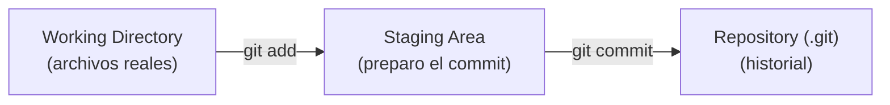
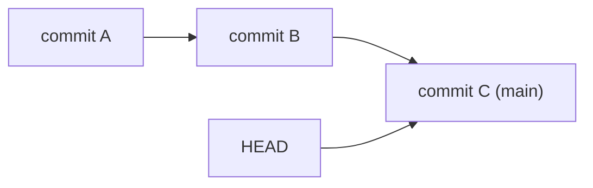
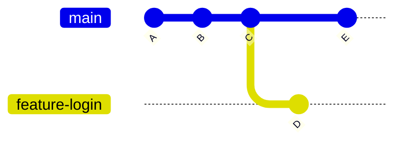
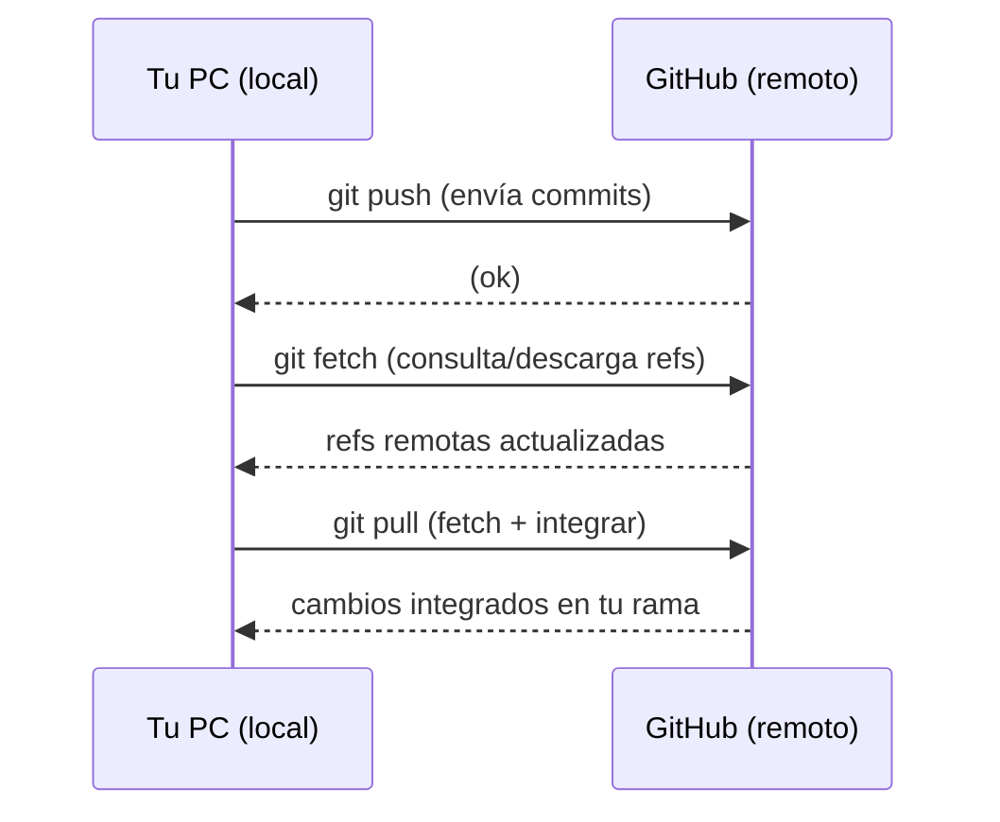

# 🛡️ MÓDULO 1 — Git & GitHub: de Cero a Profesional (Clase 1)


> **Versión pedagógica mejorada**: contenido depurado + índice linkeado + diagramas + ejercicios.

---

<a id="objetivos"></a>
## 🎯 Objetivos de aprendizaje

Al terminar esta clase podrás:

- Explicar la diferencia entre **Git** y **GitHub**.
- Usar el modelo mental correcto: **Working Directory → Staging → Repository**.
- Crear un repositorio local, hacer **commits** y leer el historial.
- Conectar tu repo local con GitHub usando **SSH** y hacer tu primer **push**.
- Entender (y practicar) ramas, merge y conflictos a nivel básico.
- Aplicar un flujo de trabajo profesional mínimo: **branch → commit → pull → merge → push**.

---

<a id="requisitos"></a>
## ✅ Requisitos previos (recomendado)

- Saber abrir una terminal (Windows: **Git Bash** / PowerShell, Mac/Linux: **Terminal**).
- Conocer comandos básicos:
  - `ls`, `cd`, `pwd`, `mkdir`
- Tener acceso a internet para instalar Git y crear cuenta en GitHub.

> [!TIP]
> Si terminal te asusta, no pasa nada: en esta clase la usas como un “control remoto” para Git.

---

<a id="indice"></a>
## 📌 Índice (linkeado)

1. [Motivación](#1-motivacion)
   1.1 [El problema sin control de versiones](#11-problema-sin-control-de-versiones)  
   1.2 [Qué resuelve Git](#12-que-resuelve-git)
2. [Conceptos base](#2-conceptos-base)
   2.1 [¿Qué es Git?](#21-que-es-git)  
   2.2 [¿Qué es GitHub?](#22-que-es-github)  
   2.3 [Git vs GitHub (tabla)](#23-git-vs-github)  
   2.4 [Las 3 áreas de Git](#24-las-3-areas-de-git)  
   2.5 [Commits, hashes y HEAD](#25-commits-hashes-y-head)  
   2.6 [¿Qué es una rama?](#26-que-es-una-rama)
3. [Instalación y setup](#3-instalacion-y-setup)
   3.1 [Instalar Git (Windows / Mac / Linux)](#31-instalar-git)  
   3.2 [Verificar instalación](#32-verificar-instalacion)  
   3.3 [Crear cuenta en GitHub](#33-crear-cuenta-en-github)  
   3.4 [Configuración inicial de Git](#34-configuracion-inicial-de-git)  
   3.5 [SSH: llaves y conexión segura](#35-ssh-llaves-y-conexion-segura)  
   3.6 [Comandos de terminal útiles](#36-comandos-de-terminal)
4. [Primer flujo de trabajo local](#4-primer-flujo-de-trabajo-local)
   4.1 [Crear repo y primer commit](#41-crear-repo-y-primer-commit)  
   4.2 [`git status`, `git add`, `git commit`](#42-status-add-commit)  
   4.3 [Ver historial (`git log`) y diferencias (`git diff`)](#43-log-y-diff)
5. [Conectar con GitHub](#5-conectar-con-github)
   5.1 [Crear repo remoto](#51-crear-repo-remoto)  
   5.2 [Conectar remoto (`git remote add`)](#52-conectar-remoto)  
   5.3 [Subir cambios (`git push`)](#53-subir-cambios)  
   5.4 [Clonar un repo (`git clone`)](#54-clonar-un-repo)
6. [Trabajo en equipo](#6-trabajo-en-equipo)
   6.1 [Fetch vs Pull vs Push](#61-fetch-vs-pull-vs-push)  
   6.2 [Merge y conflictos](#62-merge-y-conflictos)  
   6.3 [Flujo profesional recomendado](#63-flujo-profesional-recomendado)
7. [Navegar y deshacer](#7-navegar-y-deshacer)
   7.1 [Moverte entre commits (checkout/switch)](#71-moverte-entre-commits)  
   7.2 [Reset: soft / mixed / hard](#72-reset-soft-mixed-hard)
8. [Buenas prácticas, errores y checklist](#8-buenas-practicas-errores-y-checklist)
   8.1 [Buenas prácticas](#81-buenas-practicas)  
   8.2 [Errores comunes](#82-errores-comunes)  
   8.3 [Checklist profesional](#83-checklist-profesional)  
   8.4 [Hoja de trucos (cheat sheet)](#84-hoja-de-trucos)
9. [Ejercicios y evaluación](#9-ejercicios-y-evaluacion)
   9.1 [Quiz rápido](#91-quiz-rapido)  
   9.2 [Laboratorio guiado](#92-laboratorio-guiado)  
   9.3 [Ejercicio de ramas y conflictos](#93-ejercicio-de-ramas-y-conflictos)  
   9.4 [Solucionario](#94-solucionario)

---

<a id="1-motivacion"></a>
## 1) 🚨 Motivación

<a id="11-problema-sin-control-de-versiones"></a>
### 1.1 El problema sin control de versiones

Clásico:

- `proyecto_final.py`
- `proyecto_final_v2.py`
- `proyecto_final_definitivo.py`
- `proyecto_final_definitivo_ahora_si.py`

Sin control de versiones:

- No sabes qué cambió.
- No puedes volver atrás con seguridad.
- Colaborar se vuelve un caos.

<a id="12-que-resuelve-git"></a>
### 1.2 Qué resuelve Git (la “máquina del tiempo”)

Git te permite guardar “fotos” del proyecto (**commits**) cuando tú decides.

- **Volver atrás** en segundos.
- **Comparar** versiones y ver qué cambió.
- **Colaborar** con otras personas sin pisarse (y resolver conflictos cuando pasa).

> [!NOTE]
> Git sirve incluso si trabajas sola: el “yo del futuro” te lo agradece.

---

<a id="2-conceptos-base"></a>
## 2) 🧠 Conceptos base

<a id="21-que-es-git"></a>
### 2.1 ¿Qué es Git?

**Git** es un sistema de control de versiones *distribuido*.

- Guarda el historial del proyecto como una secuencia de **commits**.
- Cada commit tiene: **autor**, **fecha**, **mensaje** y un **identificador único (hash)**.

<a id="22-que-es-github"></a>
### 2.2 ¿Qué es GitHub?

**GitHub** es una plataforma web que hospeda repositorios Git en la nube.

- Respaldo remoto de tu código.
- Colaboración (pull requests, issues, revisiones).
- Integración con CI/CD y herramientas profesionales.

<a id="23-git-vs-github"></a>
### 2.3 Git vs GitHub (tabla)

| Concepto | Git | GitHub |
|---|---|---|
| Qué es | Herramienta (software) | Plataforma web |
| Dónde vive | En tu computador | En la nube |
| Para qué | Control de versiones | Colaboración + hosting |
| Requiere internet | No necesariamente | Sí (para sincronizar) |

<a id="24-las-3-areas-de-git"></a>
### 2.4 Las 3 áreas de Git (modelo mental)

Git se entiende perfecto si memorizas este flujo:

- **Working Directory**: tus archivos reales
- **Staging Area**: lo que *vas a incluir* en el próximo commit
- **Repository (.git)**: historial de commits



> [!TIP]
> Piensa en el staging como una “bandeja” donde ordenas qué entra al commit.

<a id="25-commits-hashes-y-head"></a>
### 2.5 Commits, hashes y HEAD

- Un **commit** es una “foto” del proyecto en ese momento.
- Un **hash** (SHA-1) identifica de forma única al commit.
- **HEAD** es un puntero: indica “en qué versión estoy parado ahora”.



<details>
<summary><strong>Avanzado (opcional): ¿por qué el hash es importante?</strong></summary>

El hash se calcula a partir de:
- Contenido del proyecto
- Mensaje
- Autor/fecha
- Commit padre

Si cambias una sola letra, el hash cambia completamente. Esto hace el historial:
- **Trazable**
- **Difícil de falsificar**
- **Consistente**
</details>

<a id="26-que-es-una-rama"></a>
### 2.6 ¿Qué es una rama (branch)?

Una rama **no** es una copia del proyecto.

✅ Una rama es un **puntero** a un commit.



---

<a id="3-instalacion-y-setup"></a>
## 3) 💻 Instalación y setup

<a id="31-instalar-git"></a>
### 3.1 Instalar Git (Windows / Mac / Linux)

#### 🪟 Windows
1. Ir a `https://git-scm.com`
2. Descargar Git para Windows
3. Instalar con opciones por defecto (incluye **Git Bash**)

#### 🍎 Mac
- Con Homebrew:
```bash
brew install git
```
- O con Xcode Command Line Tools:
```bash
xcode-select --install
```

#### 🐧 Linux (Debian/Ubuntu)
```bash
sudo apt update
sudo apt install git
```

> [!NOTE]
> Guía oficial: `https://git-scm.com/downloads`

<a id="32-verificar-instalacion"></a>
### 3.2 Verificar instalación

```bash
git --version
```

Deberías ver algo como: `git version 2.x.x`

<a id="33-crear-cuenta-en-github"></a>
### 3.3 Crear cuenta en GitHub

1. Ir a `https://github.com`
2. **Sign up**
3. Email + contraseña + username
4. Verificar correo

> [!TIP]
> Usa un username profesional (lo vas a mostrar en CV/LinkedIn/portafolio).

<a id="34-configuracion-inicial-de-git"></a>
### 3.4 Configuración inicial de Git (una sola vez)

```bash
git config --global user.name "Tu Nombre"
git config --global user.email "tu_email@gmail.com"
```

Verificar:
```bash
git config --list
```

Configurar rama por defecto a `main`:
```bash
git config --global init.defaultBranch main
```

Activar colores:
```bash
git config --global color.ui auto
```

Eliminar una config (si te equivocaste):
```bash
git config --global --unset user.name
```

<a id="35-ssh-llaves-y-conexion-segura"></a>
### 3.5 SSH: llaves y conexión segura

**Objetivo**: poder hacer `git push` / `git pull` sin escribir usuario/contraseña cada vez, de forma segura.

#### Paso 1 — Generar llave
```bash
ssh-keygen -t ed25519 -C "tu_email@gmail.com"
```
Presiona **ENTER** para aceptar valores por defecto.

Comprobar:
```bash
ls ~/.ssh
```
Deberías ver:
- `id_ed25519`
- `id_ed25519.pub`

#### Paso 2 — Iniciar agente y agregar llave
```bash
eval "$(ssh-agent -s)"
ssh-add ~/.ssh/id_ed25519
```

#### Paso 3 — Copiar llave pública
- Windows (Git Bash):
```bash
cat ~/.ssh/id_ed25519.pub | clip
```
- Mac:
```bash
pbcopy < ~/.ssh/id_ed25519.pub
```
- Linux:
```bash
cat ~/.ssh/id_ed25519.pub
```

#### Paso 4 — Agregar llave en GitHub
GitHub → **Settings** → **SSH and GPG keys** → **New SSH key** → pegar → guardar.

#### Paso 5 — Verificar conexión
```bash
ssh -T git@github.com
```
Salida esperada: `Hi <username>! You've successfully authenticated...`

> [!WARNING]
> **Nunca** subas tu llave privada (`id_ed25519`) a un repositorio.  
> La que se comparte es la pública (`.pub`).

---

<a id="36-comandos-de-terminal"></a>
### 3.6 Comandos de terminal útiles (Bash)

Estos comandos no son “de Git”, pero te salvan la vida:

| Acción | Comando | Nota |
|---|---|---|
| Listar archivos | `ls` | (Windows Git Bash / Mac / Linux) |
| Ver ruta actual | `pwd` | Te dice dónde estás parado |
| Entrar a carpeta | `cd carpeta` | Usa `Tab` para autocompletar |
| Subir un nivel | `cd ..` | Vuelves a la carpeta “padre” |
| Crear carpeta | `mkdir nombre` | Crea un directorio |

**Reiniciar Git si la embarraste (cuidado):**

Si necesitas “borrar Git” y empezar de nuevo *en ese proyecto*:

```bash
rm -rf .git
```

> [!WARNING]
> Esto elimina TODO el historial de Git del proyecto (commits, ramas, etc.).  
> Úsalo solo si de verdad quieres reiniciar desde cero.

---

<a id="4-primer-flujo-de-trabajo-local"></a>
## 4) 🧪 Primer flujo de trabajo local

<a id="41-crear-repo-y-primer-commit"></a>
### 4.1 Crear repo y primer commit (paso a paso)

Supongamos esta estructura:

```text
mi_proyecto/
  archivo1.py
  archivo2.py
```

> [!TIP]
> Siempre ejecuta comandos Git **dentro** de la carpeta del proyecto.

1) Entra a la carpeta:
```bash
cd mi_proyecto
pwd
```

2) Inicializa Git:
```bash
git init
```

3) Revisa estado:
```bash
git status
```

<a id="42-status-add-commit"></a>
### 4.2 `git status`, `git add`, `git commit`

- `git status` te dice qué cambió y en qué “área” está.
- `git add` mueve cambios a **staging**.
- `git commit` guarda el snapshot en el historial.

Agregar todo al staging:
```bash
git add .
```

Crear commit:
```bash
git commit -m "Agrega archivos iniciales"
```

> [!TIP]
> Si quieres ver el *diff* completo antes de confirmar el commit, usa:
>
> ```bash
> git commit -v
> ```
>
> Se abrirá tu editor con el diff incluido; escribes el mensaje arriba, guardas y cierras.


<details>
<summary><strong>Avanzado (opcional): qué hace Git internamente con add/commit</strong></summary>

- `git add` calcula hashes y prepara el snapshot (todavía **no** hay historial).
- `git commit` crea el commit, lo enlaza con su “padre” y lo agrega al historial.
</details>

<a id="43-log-y-diff"></a>
### 4.3 Ver historial (`git log`) y diferencias (`git diff`)

Historial completo:
```bash
git log
```

Resumen en una línea:
```bash
git log --oneline
```

Ver cambios aún no “commiteados”:
```bash
git diff
```

Ver cambios staged:
```bash
git diff --staged
```

---

<a id="5-conectar-con-github"></a>
## 5) 🔗 Conectar con GitHub

<a id="51-crear-repo-remoto"></a>
### 5.1 Crear repo remoto (en GitHub)

1. GitHub → **New repository**
2. Nombre (ideal: igual al proyecto local)
3. ⚠️ No marcar “Initialize with README” (para evitar conflictos de arranque)
4. Crear

<a id="52-conectar-remoto"></a>
### 5.2 Conectar remoto (`git remote add`)

Dentro del proyecto local:

```bash
git remote add origin git@github.com:USERNAME/REPO.git
```

Verifica:
```bash
git remote -v
```

> [!NOTE]
> `origin` es solo un nombre (convención). Podría llamarse distinto, pero **no** conviene.

Asegurar rama principal:
```bash
git branch -M main
```

<a id="53-subir-cambios"></a>
### 5.3 Subir cambios (`git push`)

Primer push:
```bash
git push -u origin main
```

- `-u` deja configurado el “upstream”: luego bastará con `git push`.

<a id="54-clonar-un-repo"></a>
### 5.4 Clonar un repo (`git clone`)

Para traer un proyecto ya existente:

```bash
git clone git@github.com:USERNAME/REPO.git
cd REPO
git remote -v
git branch
```

---

<a id="6-trabajo-en-equipo"></a>
## 6) 👥 Trabajo en equipo

<a id="61-fetch-vs-pull-vs-push"></a>
### 6.1 Fetch vs Pull vs Push

- `git fetch`: trae cambios del remoto, **no** los mezcla.
- `git pull`: trae cambios **y los integra** (merge o rebase).
- `git push`: envía tus commits al remoto.



> [!TIP]
> Antes de subir: **pull** (idealmente con rebase) y luego **push**.

Configurar rebase por defecto:
```bash
git config --global pull.rebase true
```

<a id="62-merge-y-conflictos"></a>
### 6.2 Merge y conflictos

**Merge** combina historiales.

Ejemplo:
```bash
git switch main
git merge feature-login
```

Si hay conflicto, verás algo como:
```text
CONFLICT (content): Merge conflict in archivo.py
```

El archivo queda con marcas:

```text
<<<<<<< HEAD
codigo en main
=======
codigo en feature-login
>>>>>>> feature-login
```

**Cómo resolver:**
1. Editar el archivo y decidir qué queda.
2. Borrar las marcas `<<<<<<<`, `=======`, `>>>>>>>`.
3. Confirmar:
```bash
git add archivo.py
git commit
```

Cancelar merge si te arrepientes:
```bash
git merge --abort
```

<a id="63-flujo-profesional-recomendado"></a>
### 6.3 Flujo profesional recomendado (mínimo viable)

```bash
git switch main
git pull --rebase
git switch -c feature-mi-cambio

# trabajar...
git add .
git commit -m "Describe tu cambio"

git switch main
git pull --rebase
git merge feature-mi-cambio
git push
```

---

<a id="7-navegar-y-deshacer"></a>
## 7) ⏪ Navegar y deshacer

<a id="71-moverte-entre-commits"></a>
### 7.1 Moverte entre commits (checkout/switch)

Ver commits:
```bash
git log --oneline
```

Mirar un commit (modo exploración):
```bash
git switch --detach <hash>
```

Volver a main:
```bash
git switch main
```

Crear una rama desde un commit antiguo:
```bash
git switch -c nueva-rama <hash>
```

> [!WARNING]
> En “detached HEAD” puedes mirar sin problemas; pero si haces commits ahí, crea una rama o perderás la referencia fácilmente.

**Checkout/Switch vs Reset (muy importante)**

| Acción | Comando típico | Qué hace | Riesgo |
|---|---|---|---|
| “Mirar” otra versión | `git switch --detach <hash>` | Cambia dónde apunta HEAD (no borra commits) | Bajo |
| Volver a una rama | `git switch main` | Vuelves al último commit de la rama | Bajo |
| Reescribir historia | `git reset ...` | Mueve la rama y puede borrar commits “visibles” | Medio/Alto |

<a id="72-reset-soft-mixed-hard"></a>
### 7.2 Reset: soft / mixed / hard

Sirve para **reescribir historial** (úsalo con cuidado).

- `--soft`: borra el commit, deja cambios en staging
- `--mixed` (default): borra el commit, deja cambios en working directory
- `--hard`: borra commit y cambios (peligroso)

```bash
git reset --soft HEAD~1
git reset --mixed HEAD~1
git reset --hard HEAD~1
```

> [!WARNING]
> `--hard` puede borrar trabajo sin retorno simple.

---

<a id="8-buenas-practicas-errores-y-checklist"></a>
## 8) ✅ Buenas prácticas, errores y checklist

<a id="81-buenas-practicas"></a>
### 8.1 Buenas prácticas

1. Commits **pequeños** y frecuentes.
2. Mensajes claros (verbo + intención):  
   - ✅ `Agrega validación de entrada`  
   - ❌ `cambios`
3. Usar `.gitignore` para evitar basura/sensibles.

Ejemplo `.gitignore` (Python):
```gitignore
__pycache__/
*.pyc
.env
venv/
```

4. Hacer `pull` antes de `push`.
5. Usar ramas para cambios.

<a id="82-errores-comunes"></a>
### 8.2 Errores comunes

- Hacer un commit gigante con 30 cosas mezcladas.
- Subir secretos (tokens, llaves, `.env`).
- Trabajar días/semanas sin sincronizar y luego sufrir conflictos enormes.
- No usar SSH y quedarse “pegado” con autenticación.

<a id="83-checklist-profesional"></a>
### 8.3 Checklist profesional

- [ ] Git instalado y verificado (`git --version`)
- [ ] Cuenta GitHub creada
- [ ] `user.name` y `user.email` configurados
- [ ] Llave SSH creada y agregada a GitHub
- [ ] Repo local con commits
- [ ] Repo remoto conectado (`origin`)
- [ ] Primer `push` exitoso
- [ ] Rama creada y mergeada al menos una vez

<a id="84-hoja-de-trucos"></a>
### 8.4 Hoja de trucos (cheat sheet)

| Objetivo | Comando |
|---|---|
| Ver estado | `git status` |
| Preparar cambios | `git add .` |
| Crear commit | `git commit -m "mensaje"` |
| Ver historial corto | `git log --oneline` |
| Ver diferencias | `git diff` |
| Crear rama | `git switch -c rama` |
| Cambiar de rama | `git switch main` |
| Integrar rama | `git merge rama` |
| Traer cambios | `git pull --rebase` |
| Subir cambios | `git push` |
| Ver remotos | `git remote -v` |

---

<a id="9-ejercicios-y-evaluacion"></a>
## 9) 🧩 Ejercicios y evaluación

<a id="91-quiz-rapido"></a>
### 9.1 Quiz rápido (conceptos)

Responde sin mirar el solucionario:

1) ¿Cuál es la diferencia principal entre Git y GitHub?  
2) Ordena correctamente el flujo: **commit / add / working directory / staging / repository**.  
3) ¿Qué muestra `git status`?  
4) ¿Qué significa “detached HEAD”?  
5) Explica con tus palabras `fetch` vs `pull`.

<a id="92-laboratorio-guiado"></a>
### 9.2 Laboratorio guiado (práctico)

Crea un proyecto desde cero y llega a GitHub:

1) Crea una carpeta y entra:
```bash
mkdir lab-git
cd lab-git
```

2) Crea un archivo:
```bash
echo "Hola Git" > README.md
```

3) Inicializa Git, agrega y commitea:
```bash
git init
git add .
git commit -m "Primer commit"
```

4) Crea un repo en GitHub llamado `lab-git` (sin README) y conéctalo:
```bash
git remote add origin git@github.com:USERNAME/lab-git.git
git branch -M main
git push -u origin main
```

✅ Evidencia mínima:
- `git log --oneline` muestra tu commit
- En GitHub ves el `README.md`

<a id="93-ejercicio-de-ramas-y-conflictos"></a>
### 9.3 Ejercicio de ramas y conflictos (nivel profesional básico)

**Objetivo**: provocar y resolver un conflicto controlado.

1) Crea una rama:
```bash
git switch -c feature-saludo
```

2) Edita `README.md` y deja:
```text
Hola desde feature
```

3) Commit:
```bash
git add README.md
git commit -m "Cambia saludo en feature"
```

4) Vuelve a main:
```bash
git switch main
```

5) Edita `README.md` y deja:
```text
Hola desde main
```

6) Commit:
```bash
git add README.md
git commit -m "Cambia saludo en main"
```

7) Intenta merge:
```bash
git merge feature-saludo
```

8) Resuelve el conflicto dejando:
```text
Hola desde main y feature
```

9) Finaliza:
```bash
git add README.md
git commit
```

✅ Evidencia mínima:
- `git log --oneline --graph --decorate` muestra el merge
- `README.md` queda con el texto final

<a id="94-solucionario"></a>
### 9.4 Solucionario (resumen)

1) Git = herramienta de control de versiones (local). GitHub = hosting/collab (remoto).  
2) Working Directory → `git add` → Staging → `git commit` → Repository.  
3) Estado de archivos: staged/unstaged/untracked y rama actual.  
4) HEAD apunta a un commit directamente (sin rama).  
5) `fetch` descarga refs/cambios sin integrar; `pull` descarga e integra (merge/rebase).  

---

## 🎯 Cierre

Git no es “solo comandos”: es una forma profesional de trabajar.

**Si dominas lo básico de esta clase:**
- piensas con historial,
- reduces errores,
- colaboras mejor,
- y te vuelves más empleable.
