# 🛡️ MÓDULO 1 — Git & GitHub: de Cero a Profesional (Clase 1)


---

<a id="objetivos"></a>

<details open>
<summary><strong>🎯 Objetivos de aprendizaje</strong></summary>


Al terminar esta clase podrás:

- Explicar la diferencia entre **Git** y **GitHub**.
- Usar el modelo mental correcto: **Working Directory → Staging → Repository**.
- Crear un repositorio local, hacer **commits** y leer el historial.
- Conectar tu repo local con GitHub usando **SSH** y hacer tu primer **push**.
- Entender (y practicar) ramas, merge y conflictos a nivel básico.
- Aplicar un flujo de trabajo profesional mínimo: **branch → commit → pull → merge → push**.

---

<a id="requisitos"></a>

</details>

<details open>
<summary><strong>✅ Requisitos previos (recomendado)</strong></summary>


- Saber abrir una terminal (Windows: **Git Bash** / PowerShell, Mac/Linux: **Terminal**).
- Conocer comandos básicos:
  - `ls`, `cd`, `pwd`, `mkdir`
- Tener acceso a internet para instalar Git y crear cuenta en GitHub.

> **`TIP`**
> Si terminal te asusta, no pasa nada: en esta clase la usas como un “control remoto” para Git.

---

<a id="indice"></a>

</details>

<details open>
<summary><strong>📌 Índice </strong></summary>


1. [Motivación](#1-motivacion)
   1.1 [El problema sin control de versiones](#11-problema-sin-control-de-versiones)  
   1.2 [Qué resuelve Git](#12-que-resuelve-git)
2. [Conceptos base](#2-conceptos-base)
   2.1 [¿Qué es Git?](#21-que-es-git)  
   2.2 [¿Qué es GitHub?](#22-que-es-github)  
   2.3 [Git vs GitHub (tabla)](#23-git-vs-github)  
   2.4 [Las 3 áreas de Git](#24-las-3-areas-de-git)  
   2.5 [Commits, hashes y HEAD](#25-commits-hashes-y-head)  
   2.6 [¿Qué es una rama?](#26-que-es-una-rama)
3. [Instalación y setup](#3-instalacion-y-setup)
   3.1 [Instalar Git (Windows / Mac / Linux)](#31-instalar-git)  
   3.2 [Verificar instalación](#32-verificar-instalacion)  
   3.3 [Crear cuenta en GitHub](#33-crear-cuenta-en-github)  
   3.4 [Configuración inicial de Git](#34-configuracion-inicial-de-git)  
   3.5 [SSH: llaves y conexión segura](#35-ssh-llaves-y-conexion-segura)  
   3.6 [Comandos de terminal útiles](#36-comandos-de-terminal)
4. [Primer flujo de trabajo local](#4-primer-flujo-de-trabajo-local)
   4.1 [Crear repo y primer commit](#41-crear-repo-y-primer-commit)  
   4.2 [`git status`, `git add`, `git commit`](#42-status-add-commit)  
   4.3 [Ver historial (`git log`) y diferencias (`git diff`)](#43-log-y-diff)
5. [Conectar con GitHub](#5-conectar-con-github)
   5.1 [Crear repo remoto](#51-crear-repo-remoto)  
   5.2 [Conectar remoto (`git remote add`)](#52-conectar-remoto)  
   5.3 [Subir cambios (`git push`)](#53-subir-cambios)  
   5.4 [Clonar un repo (`git clone`)](#54-clonar-un-repo)
6. [Trabajo en equipo](#6-trabajo-en-equipo)
   6.1 [Fetch vs Pull vs Push](#61-fetch-vs-pull-vs-push)  
   6.2 [Merge y conflictos](#62-merge-y-conflictos)  
   6.3 [Flujo profesional recomendado](#63-flujo-profesional-recomendado)
7. [Navegar y deshacer](#7-navegar-y-deshacer)
   7.1 [Moverte entre commits (checkout/switch)](#71-moverte-entre-commits)  
   7.2 [Reset: soft / mixed / hard](#72-reset-soft-mixed-hard)
8. [Buenas prácticas, errores y checklist](#8-buenas-practicas-errores-y-checklist)
   8.1 [Buenas prácticas](#81-buenas-practicas)  
   8.2 [Errores comunes](#82-errores-comunes)  
   8.3 [Checklist profesional](#83-checklist-profesional)  
   8.4 [Hoja de trucos (cheat sheet)](#84-hoja-de-trucos)
9. [Ejercicios y evaluación](#9-ejercicios-y-evaluacion)
   9.1 [Quiz rápido](#91-quiz-rapido)  
   9.2 [Laboratorio guiado](#92-laboratorio-guiado)  
   9.3 [Ejercicio de ramas y conflictos](#93-ejercicio-de-ramas-y-conflictos)  
   9.4 [Solucionario](#94-solucionario)

---

<a id="1-motivacion"></a>

</details>

<details open>
<summary><strong>1) 🚨 Motivación</strong></summary>


<a id="11-problema-sin-control-de-versiones"></a>

<details>
<summary><strong>1.1 El problema sin control de versiones</strong></summary>


Clásico:

- `proyecto_final.py`
- `proyecto_final_v2.py`
- `proyecto_final_definitivo.py`
- `proyecto_final_definitivo_ahora_si.py`

Sin control de versiones:

- No sabes qué cambió.
- No puedes volver atrás con seguridad.
- Colaborar se vuelve un caos.

<a id="12-que-resuelve-git"></a>

</details>

<details>
<summary><strong>1.2 Qué resuelve Git (la “máquina del tiempo”)</strong></summary>


Git te permite guardar “fotos” del proyecto (**commits**) cuando tú decides.

- **Volver atrás** en segundos.
- **Comparar** versiones y ver qué cambió.
- **Colaborar** con otras personas sin pisarse (y resolver conflictos cuando pasa).

> **`NOTE`**
> Git sirve incluso si trabajas sola: el “yo del futuro” te lo agradece.

---

<a id="2-conceptos-base"></a>

</details>

</details>

<details open>
<summary><strong>2) 🧠 Conceptos base</strong></summary>


<a id="21-que-es-git"></a>

<details>
<summary><strong>2.1 ¿Qué es Git?</strong></summary>


**Git** es un sistema de control de versiones *distribuido*.

- Guarda el historial del proyecto como una secuencia de **commits**.
- Cada commit tiene: **autor**, **fecha**, **mensaje** y un **identificador único (hash)**.

<a id="22-que-es-github"></a>

</details>

<details>
<summary><strong>2.2 ¿Qué es GitHub?</strong></summary>


**GitHub** es una plataforma web que hospeda repositorios Git en la nube.

- Respaldo remoto de tu código.
- Colaboración (pull requests, issues, revisiones).
- Integración con CI/CD y herramientas profesionales.

<a id="23-git-vs-github"></a>

</details>

<details>
<summary><strong>2.3 Git vs GitHub (tabla)</strong></summary>


| Concepto | Git | GitHub |
|---|---|---|
| Qué es | Herramienta (software) | Plataforma web |
| Dónde vive | En tu computador | En la nube |
| Para qué | Control de versiones | Colaboración + hosting |
| Requiere internet | No necesariamente | Sí (para sincronizar) |

<a id="24-las-3-areas-de-git"></a>

</details>

<details>
<summary><strong>2.4 Las 3 áreas de Git (modelo mental)</strong></summary>


Git se entiende perfecto si memorizas este flujo:

- **Working Directory**: tus archivos reales
- **Staging Area**: lo que *vas a incluir* en el próximo commit
- **Repository (.git)**: historial de commits


> **`TIP`**
> Piensa en el staging como una “bandeja” donde ordenas qué entra al commit.

<a id="25-commits-hashes-y-head"></a>

</details>

<details>
<summary><strong>2.5 Commits, hashes y HEAD</strong></summary>


- Un **commit** es una “foto” del proyecto en ese momento.
- Un **hash** (SHA-1) identifica de forma única al commit.
- **HEAD** es un puntero: indica “en qué versión estoy parado ahora”.


<details>
<summary><strong>Avanzado (opcional): ¿por qué el hash es importante?</strong></summary>

El hash se calcula a partir de:
- Contenido del proyecto
- Mensaje
- Autor/fecha
- Commit padre

Si cambias una sola letra, el hash cambia completamente. Esto hace el historial:
- **Trazable**
- **Difícil de falsificar**
- **Consistente**
</details>

<a id="26-que-es-una-rama"></a>

</details>

<details>
<summary><strong>2.6 ¿Qué es una rama (branch)?</strong></summary>


Una rama **no** es una copia del proyecto.

✅ Una rama es un **puntero** a un commit.


---

<a id="3-instalacion-y-setup"></a>

</details>

</details>

<details open>
<summary><strong>3) 💻 Instalación y setup</strong></summary>


<a id="31-instalar-git"></a>

<details>
<summary><strong>3.1 Instalar Git (Windows / Mac / Linux)</strong></summary>


#### 🪟 Windows
1. Ir a `https://git-scm.com`
2. Descargar Git para Windows
3. Instalar con opciones por defecto (incluye **Git Bash**)

#### 🍎 Mac
- Con Homebrew:
```bash
brew install git
```
- O con Xcode Command Line Tools:
```bash
xcode-select --install
```

#### 🐧 Linux (Debian/Ubuntu)
```bash
sudo apt update
sudo apt install git
```

> [!NOTE]
> Guía oficial: `https://git-scm.com/downloads`

<a id="32-verificar-instalacion"></a>

</details>

<details>
<summary><strong>3.2 Verificar instalación</strong></summary>


```bash
git --version
```

<!-- git-salida-ejemplo -->

<details>
<summary><strong>Salida de ejemplo: <code>git --version</code> (y cómo leerla)</strong></summary>

```console
$ git --version
git version 2.44.0
```

**Cómo leerla:**
- **git version**: indica el programa que respondió.
- **2.44.0**: versión instalada (puede variar según tu equipo).
</details>


Deberías ver algo como: `git version 2.x.x`

<a id="33-crear-cuenta-en-github"></a>

</details>

<details>
<summary><strong>3.3 Crear cuenta en GitHub</strong></summary>


1. Ir a `https://github.com`
2. **Sign up**
3. Email + contraseña + username
4. Verificar correo

> **`TIP`**
> Usa un username profesional (lo vas a mostrar en CV/LinkedIn/portafolio).

<a id="34-configuracion-inicial-de-git"></a>

</details>

<details>
<summary><strong>3.4 Configuración inicial de Git (una sola vez)</strong></summary>


```bash
git config --global user.name "Tu Nombre"
git config --global user.email "tu_email@gmail.com"
```

<!-- git-salida-ejemplo -->

<details>
<summary><strong>Salida de ejemplo: <code>git config --global user.name "Tu Nombre"</code> (y cómo leerla)</strong></summary>

```console
$ git config --global user.name "Tu Nombre"
# (sin salida si fue exitoso)
```

**Cómo leerla:**
- Guarda tu nombre en la configuración **global** (vale para todos tus repos).
- Que no aparezca nada en pantalla suele significar **éxito**.
- Puedes verificarlo con `git config --list`.
</details>

<details>
<summary><strong>Salida de ejemplo: <code>git config --global user.email "tu_email@gmail.com"</code> (y cómo leerla)</strong></summary>

```console
$ git config --global user.email "tu_email@gmail.com"
# (sin salida si fue exitoso)
```

**Cómo leerla:**
- Guarda tu email en la configuración **global**.
- Git lo usa para firmar tus commits (autoría).
- Verifica con `git config --list`.
</details>


Verificar:
```bash
git config --list
```

<!-- git-salida-ejemplo -->

<details>
<summary><strong>Salida de ejemplo: <code>git config --list</code> (y cómo leerla)</strong></summary>

```console
$ git config --list
user.name=Tu Nombre
user.email=tu_email@gmail.com
init.defaultbranch=main
color.ui=auto
core.autocrlf=input
```

**Cómo leerla:**
- Cada línea es `clave=valor`.
- `user.name` y `user.email` se usan como autor/a en los commits.
- `init.defaultbranch=main` define el nombre por defecto de la rama al hacer `git init`.
- `color.ui=auto` habilita colores en la salida (más legible).
- Verás otras claves según tu sistema (por ejemplo `core.*`).
</details>


Configurar rama por defecto a `main`:
```bash
git config --global init.defaultBranch main
```

<!-- git-salida-ejemplo -->

<details>
<summary><strong>Salida de ejemplo: <code>git config --global init.defaultBranch main</code> (y cómo leerla)</strong></summary>

```console
$ git config --global init.defaultBranch main
# (sin salida si fue exitoso)
```

**Cómo leerla:**
- Define que nuevos repositorios inicien en la rama **main**.
- No muestra salida cuando funciona correctamente.
</details>


Activar colores:
```bash
git config --global color.ui auto
```

<!-- git-salida-ejemplo -->

<details>
<summary><strong>Salida de ejemplo: <code>git config --global color.ui auto</code> (y cómo leerla)</strong></summary>

```console
$ git config --global color.ui auto
# (sin salida si fue exitoso)
```

**Cómo leerla:**
- Activa colores automáticamente en comandos como `git status` o `git diff`.
- No muestra salida cuando se aplica bien.
</details>


Eliminar una config (si te equivocaste):
```bash
git config --global --unset user.name
```

<!-- git-salida-ejemplo -->

<details>
<summary><strong>Salida de ejemplo: <code>git config --global --unset user.name</code> (y cómo leerla)</strong></summary>

```console
$ git config --global --unset user.name
# (sin salida si fue exitoso)
```

**Cómo leerla:**
- Elimina esa clave de tu configuración global.
- Útil si te equivocaste al escribir tu nombre.
</details>


<a id="35-ssh-llaves-y-conexion-segura"></a>

</details>

<details>
<summary><strong>3.5 SSH: llaves y conexión segura</strong></summary>


**Objetivo**: poder hacer `git push` / `git pull` sin escribir usuario/contraseña cada vez, de forma segura.

#### Paso 1 — Generar llave
```bash
ssh-keygen -t ed25519 -C "tu_email@gmail.com"
```
Presiona **ENTER** para aceptar valores por defecto.

Comprobar:
```bash
ls ~/.ssh
```
Deberías ver:
- `id_ed25519`
- `id_ed25519.pub`

#### Paso 2 — Iniciar agente y agregar llave
```bash
eval "$(ssh-agent -s)"
ssh-add ~/.ssh/id_ed25519
```

#### Paso 3 — Copiar llave pública
- Windows (Git Bash):
```bash
cat ~/.ssh/id_ed25519.pub | clip
```
- Mac:
```bash
pbcopy < ~/.ssh/id_ed25519.pub
```
- Linux:
```bash
cat ~/.ssh/id_ed25519.pub
```

#### Paso 4 — Agregar llave en GitHub
GitHub → **Settings** → **SSH and GPG keys** → **New SSH key** → pegar → guardar.

#### Paso 5 — Verificar conexión
```bash
ssh -T git@github.com
```
Salida esperada: `Hi <username>! You've successfully authenticated...`

> [!WARNING]
> **Nunca** subas tu llave privada (`id_ed25519`) a un repositorio.  
> La que se comparte es la pública (`.pub`).

---

<a id="36-comandos-de-terminal"></a>

</details>

<details>
<summary><strong>3.6 Comandos de terminal útiles (Bash)</strong></summary>


Estos comandos no son “de Git”, pero te salvan la vida:

| Acción | Comando | Nota |
|---|---|---|
| Listar archivos | `ls` | (Windows Git Bash / Mac / Linux) |
| Ver ruta actual | `pwd` | Te dice dónde estás parado |
| Entrar a carpeta | `cd carpeta` | Usa `Tab` para autocompletar |
| Subir un nivel | `cd ..` | Vuelves a la carpeta “padre” |
| Crear carpeta | `mkdir nombre` | Crea un directorio |

**Reiniciar Git si la embarraste (cuidado):**

Si necesitas “borrar Git” y empezar de nuevo *en ese proyecto*:

```bash
rm -rf .git
```

> [!WARNING]
> Esto elimina TODO el historial de Git del proyecto (commits, ramas, etc.).  
> Úsalo solo si de verdad quieres reiniciar desde cero.

---

<a id="4-primer-flujo-de-trabajo-local"></a>

</details>

</details>

<details open>
<summary><strong>4) 🧪 Primer flujo de trabajo local</strong></summary>


<a id="41-crear-repo-y-primer-commit"></a>

<details>
<summary><strong>4.1 Crear repo y primer commit (paso a paso)</strong></summary>


Supongamos esta estructura:

```text
mi_proyecto/
  archivo1.py
  archivo2.py
```

> **`TIP`**
> Siempre ejecuta comandos Git **dentro** de la carpeta del proyecto.

1) Entra a la carpeta:
```bash
cd mi_proyecto
pwd
```

2) Inicializa Git:
```bash
git init
```

<!-- git-salida-ejemplo -->

<details>
<summary><strong>Salida de ejemplo: <code>git init</code> (y cómo leerla)</strong></summary>

```console
$ git init
Initialized empty Git repository in /ruta/a/mi_proyecto/.git/
```

**Cómo leerla:**
- Crea la carpeta oculta **.git/**: ahí vive el historial (commits, ramas, config).
- La ruta exacta cambia según tu computadora.
</details>


3) Revisa estado:
```bash
git status
```

<!-- git-salida-ejemplo -->

<details>
<summary><strong>Salida de ejemplo: <code>git status</code> (y cómo leerla)</strong></summary>

```console
$ git status
On branch main

No commits yet

Untracked files:
  (use "git add <file>..." to include in what will be committed)
        README.md

nothing added to commit but untracked files present (use "git add" to track)
```

**Cómo leerla:**
- `On branch main`: estás en la rama **main**.
- `No commits yet`: todavía no existe ningún commit en este repo.
- `Untracked files`: Git ve archivos nuevos, pero aún **no los sigue**.
- La línea `use "git add..."` es una sugerencia de Git.
- `README.md` aparece indentado: es el archivo sin seguimiento.
</details>


<a id="42-status-add-commit"></a>

</details>

<details>
<summary><strong>4.2 <code>git status</code>, <code>git add</code>, <code>git commit</code></strong></summary>


- `git status` te dice qué cambió y en qué “área” está.
- `git add` mueve cambios a **staging**.
- `git commit` guarda el snapshot en el historial.

Agregar todo al staging:
```bash
git add .
```

<!-- git-salida-ejemplo -->

<details>
<summary><strong>Salida de ejemplo: <code>git add .</code> (y cómo leerla)</strong></summary>

```console
$ git add .
# (sin salida si fue exitoso)
```

**Cómo leerla:**
- `git add` mueve cambios al **Staging Area** (lo que entrará al próximo commit).
- Cuando funciona, normalmente **no imprime nada**.
- Para confirmar, usa `git status` (verás 'Changes to be committed').
</details>


Crear commit:
```bash
git commit -m "Agrega archivos iniciales"
```

<!-- git-salida-ejemplo -->

<details>
<summary><strong>Salida de ejemplo: <code>git commit -m "Agrega archivos iniciales"</code> (y cómo leerla)</strong></summary>

```console
$ git commit -m "Agrega archivos iniciales"
[main (root-commit) 1a2b3c4] Agrega archivos iniciales
 1 file changed, 1 insertion(+)
 create mode 100644 README.md
```

**Cómo leerla:**
- `[main ...]`: commit creado en la rama **main**.
- `(root-commit)`: es el **primer commit** del repo (si no es el primero, no aparece).
- `1a2b3c4`: hash corto del commit (identificador).
- Luego Git resume el impacto: archivos cambiados e inserciones/eliminaciones.
- `create mode 100644`: archivo nuevo con permisos/metadata (puede variar por sistema).
</details>


> **`TIP`**
> Si quieres ver el *diff* completo antes de confirmar el commit, usa:
>
> ```bash
> git commit -v
> ```
>
> Se abrirá tu editor con el diff incluido; escribes el mensaje arriba, guardas y cierras.


<details>
<summary><strong>Avanzado (opcional): qué hace Git internamente con add/commit</strong></summary>

- `git add` calcula hashes y prepara el snapshot (todavía **no** hay historial).
- `git commit` crea el commit, lo enlaza con su “padre” y lo agrega al historial.
</details>

<a id="43-log-y-diff"></a>

</details>

<details>
<summary><strong>4.3 Ver historial (<code>git log</code>) y diferencias (<code>git diff</code>)</strong></summary>


Historial completo:
```bash
git log
```

Resumen en una línea:
```bash
git log --oneline
```

<!-- git-salida-ejemplo -->

<details>
<summary><strong>Salida de ejemplo: <code>git log --oneline</code> (y cómo leerla)</strong></summary>

```console
$ git log --oneline
1a2b3c4 Primer commit
```

**Cómo leerla:**
- `1a2b3c4`: hash corto.
- Luego viene el mensaje del commit en una sola línea (útil para leer rápido).
</details>


Ver cambios aún no “commiteados”:
```bash
git diff
```

<!-- git-salida-ejemplo -->

<details>
<summary><strong>Salida de ejemplo: <code>git diff</code> (y cómo leerla)</strong></summary>

```console
$ git diff
diff --git a/README.md b/README.md
index e69de29..3b18e5a 100644
--- a/README.md
+++ b/README.md
@@ -0,0 +1 @@
+Hola Git
```

**Cómo leerla:**
- `diff --git a/... b/...`: archivo comparado (antes vs después).
- `index ...`: hashes internos del contenido + modo del archivo.
- `--- a/...` y `+++ b/...`: versión antigua y nueva.
- `@@ -0,0 +1 @@`: bloque ('hunk') del cambio (líneas afectadas).
- Líneas con `+` se agregan; con `-` se eliminan.
</details>


Ver cambios staged:
```bash
git diff --staged
```

<!-- git-salida-ejemplo -->

<details>
<summary><strong>Salida de ejemplo: <code>git diff --staged</code> (y cómo leerla)</strong></summary>

```console
$ git diff --staged
diff --git a/README.md b/README.md
--- a/README.md
+++ b/README.md
@@ -0,0 +1 @@
+Hola Git
```

**Cómo leerla:**
- Muestra diferencias **ya en staging** (lo que entrará al próximo commit).
- La lectura del diff (líneas `+` / `-`) es igual que `git diff`.
</details>


---

<a id="5-conectar-con-github"></a>

</details>

</details>

<details open>
<summary><strong>5) 🔗 Conectar con GitHub</strong></summary>


<a id="51-crear-repo-remoto"></a>

<details>
<summary><strong>5.1 Crear repo remoto (en GitHub)</strong></summary>


1. GitHub → **New repository**
2. Nombre (ideal: igual al proyecto local)
3. ⚠️ No marcar “Initialize with README” (para evitar conflictos de arranque)
4. Crear

<a id="52-conectar-remoto"></a>

</details>

<details>
<summary><strong>5.2 Conectar remoto (<code>git remote add</code>)</strong></summary>


Dentro del proyecto local:

```bash
git remote add origin git@github.com:USERNAME/REPO.git
```

<!-- git-salida-ejemplo -->

<details>
<summary><strong>Salida de ejemplo: <code>git remote add origin git@github.com:USERNAME/REPO.git</code> (y cómo leerla)</strong></summary>

```console
$ git remote add origin git@github.com:USERNAME/REPO.git
# (sin salida si fue exitoso)
```

**Cómo leerla:**
- Registra un remoto llamado **origin** apuntando a la URL indicada.
- No sube nada todavía: solo 'conecta' tu repo local con el remoto.
- Verifica con `git remote -v`.
</details>


Verifica:
```bash
git remote -v
```

<!-- git-salida-ejemplo -->

<details>
<summary><strong>Salida de ejemplo: <code>git remote -v</code> (y cómo leerla)</strong></summary>

```console
$ git remote -v
origin  git@github.com:USERNAME/REPO.git (fetch)
origin  git@github.com:USERNAME/REPO.git (push)
```

**Cómo leerla:**
- `origin`: nombre del remoto.
- La URL puede ser SSH (`git@github.com:...`) o HTTPS.
- `(fetch)` indica la URL usada para **traer** cambios.
- `(push)` indica la URL usada para **subir** cambios (a veces son distintas).
</details>


> **`NOTE`**
> `origin` es solo un nombre (convención). Podría llamarse distinto, pero **no** conviene.

Asegurar rama principal:
```bash
git branch -M main
```

<!-- git-salida-ejemplo -->

<details>
<summary><strong>Salida de ejemplo: <code>git branch -M main</code> (y cómo leerla)</strong></summary>

```console
$ git branch -M main
# (sin salida si fue exitoso)
```

**Cómo leerla:**
- Renombra la rama actual a **main** (o la define como nombre).
- `-M` fuerza el rename incluso si ya existe (úsalo con cuidado).
</details>


<a id="53-subir-cambios"></a>

</details>

<details>
<summary><strong>5.3 Subir cambios (<code>git push</code>)</strong></summary>


Primer push:
```bash
git push -u origin main
```

<!-- git-salida-ejemplo -->

<details>
<summary><strong>Salida de ejemplo: <code>git push -u origin main</code> (y cómo leerla)</strong></summary>

```console
$ git push -u origin main
Enumerating objects: 3, done.
Counting objects: 100% (3/3), done.
Writing objects: 100% (3/3), 234 bytes | 234.00 KiB/s, done.
Total 3 (delta 0), reused 0 (delta 0), pack-reused 0
To github.com:USERNAME/REPO.git
 * [new branch]      main -> main
branch 'main' set up to track 'origin/main'.
```

**Cómo leerla:**
- Git empaqueta ('objects') y los envía al remoto.
- `To ...`: destino (GitHub).
- `[new branch] main -> main`: se creó la rama `main` en el remoto.
- `set up to track`: deja configurado el upstream; luego basta con `git push` / `git pull`.
</details>


- `-u` deja configurado el “upstream”: luego bastará con `git push`.

<a id="54-clonar-un-repo"></a>

</details>

<details>
<summary><strong>5.4 Clonar un repo (<code>git clone</code>)</strong></summary>


Para traer un proyecto ya existente:

```bash
git clone git@github.com:USERNAME/REPO.git
cd REPO
git remote -v
git branch
```

<!-- git-salida-ejemplo -->

<details>
<summary><strong>Salida de ejemplo: <code>git clone git@github.com:USERNAME/REPO.git</code> (y cómo leerla)</strong></summary>

```console
$ git clone git@github.com:USERNAME/REPO.git
Cloning into 'REPO'...
remote: Enumerating objects: 12, done.
remote: Counting objects: 100% (12/12), done.
Receiving objects: 100% (12/12), 3.12 KiB | 3.12 MiB/s, done.
Resolving deltas: 100% (2/2), done.
```

**Cómo leerla:**
- Crea una carpeta con el nombre del repo y descarga el historial completo.
- `Receiving objects`: descarga de commits/archivos.
- `Resolving deltas`: Git reconstruye cambios incrementales (optimización).
</details>

<details>
<summary><strong>Salida de ejemplo: <code>git remote -v</code> (y cómo leerla)</strong></summary>

```console
$ git remote -v
origin  git@github.com:USERNAME/REPO.git (fetch)
origin  git@github.com:USERNAME/REPO.git (push)
```

**Cómo leerla:**
- `origin`: nombre del remoto.
- La URL puede ser SSH (`git@github.com:...`) o HTTPS.
- `(fetch)` indica la URL usada para **traer** cambios.
- `(push)` indica la URL usada para **subir** cambios (a veces son distintas).
</details>

<details>
<summary><strong>Salida de ejemplo: <code>git branch</code> (y cómo leerla)</strong></summary>

```console
$ git branch
* main
```

**Cómo leerla:**
- Lista ramas locales.
- El `*` marca la rama en la que estás actualmente.
</details>


---

<a id="6-trabajo-en-equipo"></a>

</details>

</details>

<details open>
<summary><strong>6) 👥 Trabajo en equipo</strong></summary>


<a id="61-fetch-vs-pull-vs-push"></a>

<details>
<summary><strong>6.1 Fetch vs Pull vs Push</strong></summary>


- `git fetch`: trae cambios del remoto, **no** los mezcla.
- `git pull`: trae cambios **y los integra** (merge o rebase).
- `git push`: envía tus commits al remoto.

```mermaid
sequenceDiagram
  participant L as Tu PC (local)
  participant R as GitHub (remoto)
  L->>R: git push (envía commits)
  R-->>L: (ok)
  L->>R: git fetch (consulta/descarga refs)
  R-->>L: refs remotas actualizadas
  L->>R: git pull (fetch + integrar)
  R-->>L: cambios integrados en tu rama
```



> **`TIP`**
> Antes de subir: **pull** (idealmente con rebase) y luego **push**.

Configurar rebase por defecto:
```bash
git config --global pull.rebase true
```

<!-- git-salida-ejemplo -->

<details>
<summary><strong>Salida de ejemplo: <code>git config --global pull.rebase true</code> (y cómo leerla)</strong></summary>

```console
$ git config --global pull.rebase true
# (sin salida si fue exitoso)
```

**Cómo leerla:**
- Hace que `git pull` use **rebase** por defecto (historial más lineal).
- No cambia tus commits; solo cómo integras cambios al traer del remoto.
</details>


<a id="62-merge-y-conflictos"></a>

</details>

<details>
<summary><strong>6.2 Merge y conflictos</strong></summary>


**Merge** combina historiales.

Ejemplo:
```bash
git switch main
git merge feature-login
```

<!-- git-salida-ejemplo -->

<details>
<summary><strong>Salida de ejemplo: <code>git switch main</code> (y cómo leerla)</strong></summary>

```console
$ git switch main
Switched to branch 'main'
Your branch is up to date with 'origin/main'.
```

**Cómo leerla:**
- Te mueve a la rama `main`.
- La segunda línea aparece si `main` está vinculada al remoto (tracking).
</details>

<details>
<summary><strong>Salida de ejemplo: <code>git merge feature-login</code> (y cómo leerla)</strong></summary>

```console
$ git merge feature-login
Updating 1a2b3c4..4d5e6f7
Fast-forward
 README.md | 2 ++
 1 file changed, 2 insertions(+)
```

**Cómo leerla:**
- Git integra la rama `feature-login` en la rama actual.
- `Fast-forward`: no hubo divergencia; Git solo avanzó el puntero de la rama.
- Luego muestra un resumen de archivos y cambios aplicados.
</details>


Si hay conflicto, verás algo como:
```text
CONFLICT (content): Merge conflict in archivo.py
```

El archivo queda con marcas:

```text
<<<<<<< HEAD
codigo en main
=======
codigo en feature-login
>>>>>>> feature-login
```

**Cómo resolver:**
1. Editar el archivo y decidir qué queda.
2. Borrar las marcas `<<<<<<<`, `=======`, `>>>>>>>`.
3. Confirmar:
```bash
git add archivo.py
git commit
```

<!-- git-salida-ejemplo -->

<details>
<summary><strong>Salida de ejemplo: <code>git add archivo.py</code> (y cómo leerla)</strong></summary>

```console
$ git add archivo.py
# (sin salida si fue exitoso)
```

**Cómo leerla:**
- `git add` mueve cambios al **Staging Area** (lo que entrará al próximo commit).
- Cuando funciona, normalmente **no imprime nada**.
- Para confirmar, usa `git status` (verás 'Changes to be committed').
</details>

<details>
<summary><strong>Salida de ejemplo: <code>git commit</code> (y cómo leerla)</strong></summary>

```console
$ git commit
# Se abre tu editor para escribir el mensaje del commit…
# Al guardar y cerrar, Git confirma:
[main 3d4e5f6] Mensaje del commit
 1 file changed, 2 insertions(+), 1 deletion(-)
```

**Cómo leerla:**
- Si no usas `-m`, Git abre el editor configurado (nano/vim/VS Code, etc.).
- Tras cerrar el editor, aparece el resumen del commit (similar al de `-m`).
</details>


Cancelar merge si te arrepientes:
```bash
git merge --abort
```

<!-- git-salida-ejemplo -->

<details>
<summary><strong>Salida de ejemplo: <code>git merge --abort</code> (y cómo leerla)</strong></summary>

```console
$ git merge --abort
Updating 1a2b3c4..4d5e6f7
Fast-forward
 README.md | 2 ++
 1 file changed, 2 insertions(+)
```

**Cómo leerla:**
- Git integra la rama `--abort` en la rama actual.
- `Fast-forward`: no hubo divergencia; Git solo avanzó el puntero de la rama.
- Luego muestra un resumen de archivos y cambios aplicados.
</details>


<a id="63-flujo-profesional-recomendado"></a>

</details>

<details>
<summary><strong>6.3 Flujo profesional recomendado (mínimo viable)</strong></summary>


```bash
git switch main
git pull --rebase
git switch -c feature-mi-cambio

# trabajar...
git add .
git commit -m "Describe tu cambio"

git switch main
git pull --rebase
git merge feature-mi-cambio
git push
```

<!-- git-salida-ejemplo -->

<details>
<summary><strong>Salida de ejemplo: <code>git switch main</code> (y cómo leerla)</strong></summary>

```console
$ git switch main
Switched to branch 'main'
Your branch is up to date with 'origin/main'.
```

**Cómo leerla:**
- Te mueve a la rama `main`.
- La segunda línea aparece si `main` está vinculada al remoto (tracking).
</details>

<details>
<summary><strong>Salida de ejemplo: <code>git pull --rebase</code> (y cómo leerla)</strong></summary>

```console
$ git pull --rebase
From github.com:USERNAME/REPO
 * branch            main       -> FETCH_HEAD
Already up to date.
```

**Cómo leerla:**
- `From ...`: remoto desde el que traes.
- `main -> FETCH_HEAD`: referencia temporal del contenido descargado.
- `Already up to date`: no hay cambios nuevos en el remoto.
- Si hubiera cambios, verías mensajes de rebase ('Rebasing (1/...)').
</details>

<details>
<summary><strong>Salida de ejemplo: <code>git switch -c feature-mi-cambio</code> (y cómo leerla)</strong></summary>

```console
$ git switch -c feature-mi-cambio
Switched to a new branch 'feature-mi-cambio'
```

**Cómo leerla:**
- Crea la rama y cambia a ella en el mismo paso.
- Desde ahí, tus commits quedarán en esa rama.
</details>

<details>
<summary><strong>Salida de ejemplo: <code>git add .</code> (y cómo leerla)</strong></summary>

```console
$ git add .
# (sin salida si fue exitoso)
```

**Cómo leerla:**
- `git add` mueve cambios al **Staging Area** (lo que entrará al próximo commit).
- Cuando funciona, normalmente **no imprime nada**.
- Para confirmar, usa `git status` (verás 'Changes to be committed').
</details>

<details>
<summary><strong>Salida de ejemplo: <code>git commit -m "Describe tu cambio"</code> (y cómo leerla)</strong></summary>

```console
$ git commit -m "Describe tu cambio"
[main (root-commit) 1a2b3c4] Describe tu cambio
 1 file changed, 1 insertion(+)
 create mode 100644 README.md
```

**Cómo leerla:**
- `[main ...]`: commit creado en la rama **main**.
- `(root-commit)`: es el **primer commit** del repo (si no es el primero, no aparece).
- `1a2b3c4`: hash corto del commit (identificador).
- Luego Git resume el impacto: archivos cambiados e inserciones/eliminaciones.
- `create mode 100644`: archivo nuevo con permisos/metadata (puede variar por sistema).
</details>

<details>
<summary><strong>Salida de ejemplo: <code>git switch main</code> (y cómo leerla)</strong></summary>

```console
$ git switch main
Switched to branch 'main'
Your branch is up to date with 'origin/main'.
```

**Cómo leerla:**
- Te mueve a la rama `main`.
- La segunda línea aparece si `main` está vinculada al remoto (tracking).
</details>

<details>
<summary><strong>Salida de ejemplo: <code>git pull --rebase</code> (y cómo leerla)</strong></summary>

```console
$ git pull --rebase
From github.com:USERNAME/REPO
 * branch            main       -> FETCH_HEAD
Already up to date.
```

**Cómo leerla:**
- `From ...`: remoto desde el que traes.
- `main -> FETCH_HEAD`: referencia temporal del contenido descargado.
- `Already up to date`: no hay cambios nuevos en el remoto.
- Si hubiera cambios, verías mensajes de rebase ('Rebasing (1/...)').
</details>

<details>
<summary><strong>Salida de ejemplo: <code>git merge feature-mi-cambio</code> (y cómo leerla)</strong></summary>

```console
$ git merge feature-mi-cambio
Updating 1a2b3c4..4d5e6f7
Fast-forward
 README.md | 2 ++
 1 file changed, 2 insertions(+)
```

**Cómo leerla:**
- Git integra la rama `feature-mi-cambio` en la rama actual.
- `Fast-forward`: no hubo divergencia; Git solo avanzó el puntero de la rama.
- Luego muestra un resumen de archivos y cambios aplicados.
</details>

<details>
<summary><strong>Salida de ejemplo: <code>git push</code> (y cómo leerla)</strong></summary>

```console
$ git push
Everything up-to-date
```

**Cómo leerla:**
- Significa que el remoto ya tiene los mismos commits que tu rama local.
- Si hubiera cambios, verías un envío similar al primer `push`.
</details>


---

<a id="7-navegar-y-deshacer"></a>

</details>

</details>

<details open>
<summary><strong>7) ⏪ Navegar y deshacer</strong></summary>


<a id="71-moverte-entre-commits"></a>

<details>
<summary><strong>7.1 Moverte entre commits (checkout/switch)</strong></summary>


Ver commits:
```bash
git log --oneline
```

<!-- git-salida-ejemplo -->

<details>
<summary><strong>Salida de ejemplo: <code>git log --oneline</code> (y cómo leerla)</strong></summary>

```console
$ git log --oneline
1a2b3c4 Primer commit
```

**Cómo leerla:**
- `1a2b3c4`: hash corto.
- Luego viene el mensaje del commit en una sola línea (útil para leer rápido).
</details>


Mirar un commit (modo exploración):
```bash
git switch --detach <hash>
```

<!-- git-salida-ejemplo -->

<details>
<summary><strong>Salida de ejemplo: <code>git switch --detach <hash></code> (y cómo leerla)</strong></summary>

```console
$ git switch --detach <hash>
Note: switching to '<hash>'.

You are in 'detached HEAD' state. You can look around, make experimental
changes and commit them, and you can discard any commits you make in this
state without impacting any branches by switching back to a branch.
```

**Cómo leerla:**
- Entraste a **detached HEAD**: no estás en una rama, estás parada en un commit.
- Puedes explorar; si haces commits aquí, crea una rama para no perderlos.
</details>


Volver a main:
```bash
git switch main
```

<!-- git-salida-ejemplo -->

<details>
<summary><strong>Salida de ejemplo: <code>git switch main</code> (y cómo leerla)</strong></summary>

```console
$ git switch main
Switched to branch 'main'
Your branch is up to date with 'origin/main'.
```

**Cómo leerla:**
- Te mueve a la rama `main`.
- La segunda línea aparece si `main` está vinculada al remoto (tracking).
</details>


Crear una rama desde un commit antiguo:
```bash
git switch -c nueva-rama <hash>
```

<!-- git-salida-ejemplo -->

<details>
<summary><strong>Salida de ejemplo: <code>git switch -c nueva-rama <hash></code> (y cómo leerla)</strong></summary>

```console
$ git switch -c nueva-rama <hash>
Switched to a new branch '<hash>'
```

**Cómo leerla:**
- Crea la rama y cambia a ella en el mismo paso.
- Desde ahí, tus commits quedarán en esa rama.
</details>


> [!WARNING]
> En “detached HEAD” puedes mirar sin problemas; pero si haces commits ahí, crea una rama o perderás la referencia fácilmente.

**Checkout/Switch vs Reset (muy importante)**

| Acción | Comando típico | Qué hace | Riesgo |
|---|---|---|---|
| “Mirar” otra versión | `git switch --detach <hash>` | Cambia dónde apunta HEAD (no borra commits) | Bajo |
| Volver a una rama | `git switch main` | Vuelves al último commit de la rama | Bajo |
| Reescribir historia | `git reset ...` | Mueve la rama y puede borrar commits “visibles” | Medio/Alto |

<a id="72-reset-soft-mixed-hard"></a>

</details>

<details>
<summary><strong>7.2 Reset: soft / mixed / hard</strong></summary>


Sirve para **reescribir historial** (úsalo con cuidado).

- `--soft`: borra el commit, deja cambios en staging
- `--mixed` (default): borra el commit, deja cambios en working directory
- `--hard`: borra commit y cambios (peligroso)

```bash
git reset --soft HEAD~1
git reset --mixed HEAD~1
git reset --hard HEAD~1
```

<!-- git-salida-ejemplo -->

<details>
<summary><strong>Salida de ejemplo: <code>git reset --soft HEAD~1</code> (y cómo leerla)</strong></summary>

```console
$ git reset --soft HEAD~1
# (sin salida si fue exitoso)
```

**Cómo leerla:**
- Mueve la rama 1 commit hacia atrás, pero deja los cambios en **staging**.
- Luego `git status` mostrará 'Changes to be committed'.
</details>

<details>
<summary><strong>Salida de ejemplo: <code>git reset --mixed HEAD~1</code> (y cómo leerla)</strong></summary>

```console
$ git reset --mixed HEAD~1
# (sin salida si fue exitoso)
```

**Cómo leerla:**
- Mueve la rama 1 commit hacia atrás y deja los cambios en el **Working Directory** (no staged).
- Luego `git status` mostrará cambios 'not staged for commit'.
</details>

<details>
<summary><strong>Salida de ejemplo: <code>git reset --hard HEAD~1</code> (y cómo leerla)</strong></summary>

```console
$ git reset --hard HEAD~1
# (sin salida si fue exitoso)
```

**Cómo leerla:**
- Mueve la rama 1 commit hacia atrás y **descarta** los cambios del working directory.
- Es destructivo: úsalo solo si estás segura.
</details>


> [!WARNING]
> `--hard` puede borrar trabajo sin retorno simple.

---

<a id="8-buenas-practicas-errores-y-checklist"></a>

</details>

</details>

<details open>
<summary><strong>8) ✅ Buenas prácticas, errores y checklist</strong></summary>


<a id="81-buenas-practicas"></a>

<details>
<summary><strong>8.1 Buenas prácticas</strong></summary>


1. Commits **pequeños** y frecuentes.
2. Mensajes claros (verbo + intención):  
   - ✅ `Agrega validación de entrada`  
   - ❌ `cambios`
3. Usar `.gitignore` para evitar basura/sensibles.

Ejemplo `.gitignore` (Python):
```gitignore
__pycache__/
*.pyc
.env
venv/
```

4. Hacer `pull` antes de `push`.
5. Usar ramas para cambios.

<a id="82-errores-comunes"></a>

</details>

<details>
<summary><strong>8.2 Errores comunes</strong></summary>


- Hacer un commit gigante con 30 cosas mezcladas.
- Subir secretos (tokens, llaves, `.env`).
- Trabajar días/semanas sin sincronizar y luego sufrir conflictos enormes.
- No usar SSH y quedarse “pegado” con autenticación.

<a id="83-checklist-profesional"></a>

</details>

<details>
<summary><strong>8.3 Checklist profesional</strong></summary>


- [ ] Git instalado y verificado (`git --version`)
- [ ] Cuenta GitHub creada
- [ ] `user.name` y `user.email` configurados
- [ ] Llave SSH creada y agregada a GitHub
- [ ] Repo local con commits
- [ ] Repo remoto conectado (`origin`)
- [ ] Primer `push` exitoso
- [ ] Rama creada y mergeada al menos una vez

<a id="84-hoja-de-trucos"></a>

</details>

<details>
<summary><strong>8.4 Hoja de trucos (cheat sheet)</strong></summary>


| Objetivo | Comando |
|---|---|
| Ver estado | `git status` |
| Preparar cambios | `git add .` |
| Crear commit | `git commit -m "mensaje"` |
| Ver historial corto | `git log --oneline` |
| Ver diferencias | `git diff` |
| Crear rama | `git switch -c rama` |
| Cambiar de rama | `git switch main` |
| Integrar rama | `git merge rama` |
| Traer cambios | `git pull --rebase` |
| Subir cambios | `git push` |
| Ver remotos | `git remote -v` |

---

<a id="9-ejercicios-y-evaluacion"></a>

</details>

</details>

<details open>
<summary><strong>9) 🧩 Ejercicios y evaluación</strong></summary>


<a id="91-quiz-rapido"></a>

<details>
<summary><strong>9.1 Quiz rápido (conceptos)</strong></summary>


Responde sin mirar el solucionario:

1) ¿Cuál es la diferencia principal entre Git y GitHub?  
2) Ordena correctamente el flujo: **commit / add / working directory / staging / repository**.  
3) ¿Qué muestra `git status`?  
4) ¿Qué significa “detached HEAD”?  
5) Explica con tus palabras `fetch` vs `pull`.

<a id="92-laboratorio-guiado"></a>

</details>

<details>
<summary><strong>9.2 Laboratorio guiado (práctico)</strong></summary>


Crea un proyecto desde cero y llega a GitHub:

1) Crea una carpeta y entra:
```bash
mkdir lab-git
cd lab-git
```

2) Crea un archivo:
```bash
echo "Hola Git" > README.md
```

3) Inicializa Git, agrega y commitea:
```bash
git init
git add .
git commit -m "Primer commit"
```

<details>
<summary><strong>Salida de ejemplo (paso 3) y cómo leerla</strong></summary>

**1) `git init`**
```console
$ git init
Initialized empty Git repository in /ruta/lab-git/.git/
```
- `Initialized empty Git repository`: Git creó el repositorio local.
- La ruta termina en `/.git/`: esa carpeta guarda el historial (commits, ramas, etc.).

**2) `git add .`**
```console
$ git add .
# (sin salida)
```
- Si **no aparece nada**, normalmente significa que salió bien.
- `.` significa: “agrega todo lo que cambió en esta carpeta”.

**3) `git commit -m "Primer commit"`**
```console
$ git commit -m "Primer commit"
[main (root-commit) a1b2c3d] Primer commit
 1 file changed, 1 insertion(+)
 create mode 100644 README.md
```
- `[main ...]`: el commit quedó en la rama `main`.
- `(root-commit)`: es el **primer commit** del repo.
- `a1b2c3d`: hash corto del commit (identificador).
- `1 file changed, 1 insertion(+)`: resumen del cambio.
- `create mode ... README.md`: Git registró que el archivo se creó y ahora está versionado.

</details>

4) Crea un repo en GitHub llamado `lab-git` (sin README) y conéctalo:
```bash
git remote add origin git@github.com:USERNAME/lab-git.git
git branch -M main
git push -u origin main
```

<details>
<summary><strong>Salida de ejemplo (paso 4) y cómo leerla</strong></summary>

**1) `git remote add origin ...`**
```console
$ git remote add origin git@github.com:USERNAME/lab-git.git
# (sin salida)
```
- Silencio = OK (en la mayoría de casos).
- `origin` es el nombre convencional del remoto principal.

> Para verificar:
> ```console
> $ git remote -v
> origin  git@github.com:USERNAME/lab-git.git (fetch)
> origin  git@github.com:USERNAME/lab-git.git (push)
> ```
> - `(fetch)` URL usada para traer cambios.
> - `(push)` URL usada para subir cambios.

**2) `git branch -M main`**
```console
$ git branch -M main
# (sin salida)
```
- `-M` fuerza el renombrado/creación de la rama principal como `main`.

**3) `git push -u origin main`**
```console
$ git push -u origin main
Enumerating objects: 3, done.
Counting objects: 100% (3/3), done.
Writing objects: 100% (3/3), 230 bytes | 230.00 KiB/s, done.
Total 3 (delta 0), reused 0 (delta 0), pack-reused 0
To github.com:USERNAME/lab-git.git
 * [new branch]      main -> main
branch 'main' set up to track 'origin/main'.
```
- `Enumerating/Counting/Writing objects`: Git empaqueta y sube tus commits/archivos.
- `To github.com:...`: destino remoto.
- `[new branch] main -> main`: creó `main` en GitHub.
- `set up to track`: deja configurado el “upstream”, luego bastará con `git push` / `git pull`.

</details>

✅ Evidencia mínima:
- `git log --oneline` muestra tu commit
- En GitHub ves el `README.md`

<details>
<summary><strong>Salida de ejemplo: <code>git log --oneline</code></strong></summary>

```console
$ git log --oneline
a1b2c3d (HEAD -> main, origin/main) Primer commit
```
- `a1b2c3d`: hash corto del commit.
- `HEAD -> main`: estás parado en `main` y HEAD apunta a ese commit.
- `origin/main`: GitHub tiene esa misma punta de rama.
- `Primer commit`: mensaje del commit.

</details>

<a id="93-ejercicio-de-ramas-y-conflictos"></a>

</details>

<details>
<summary><strong>9.3 Ejercicio de ramas y conflictos (nivel profesional básico)</strong></summary>


**Objetivo**: provocar y resolver un conflicto controlado.

1) Crea una rama:
```bash
git switch -c feature-saludo
```

<details>
<summary><strong>Salida de ejemplo: <code>git switch -c</code></strong></summary>

```console
$ git switch -c feature-saludo
Switched to a new branch 'feature-saludo'
```
- `Switched...`: ahora estás trabajando en la rama nueva.
- `feature-saludo`: nombre de la rama (puntero a commits).

</details>

2) Edita `README.md` y deja:
```text
Hola desde feature
```

3) Commit:
```bash
git add README.md
git commit -m "Cambia saludo en feature"
```

<details>
<summary><strong>Salida de ejemplo (paso 3) y cómo leerla</strong></summary>

**1) `git add README.md`**
```console
$ git add README.md
# (sin salida)
```
- El archivo quedó en **staging** (listo para el próximo commit).

**2) `git commit -m "Cambia saludo en feature"`**
```console
$ git commit -m "Cambia saludo en feature"
[feature-saludo d4e5f6a] Cambia saludo en feature
 1 file changed, 1 insertion(+), 1 deletion(-)
```
- `[feature-saludo ...]`: commit creado en esa rama.
- `d4e5f6a`: hash corto del commit.
- `insertion/deletion`: reemplazaste una línea por otra.

</details>

4) Vuelve a main:
```bash
git switch main
```

<details>
<summary><strong>Salida de ejemplo: <code>git switch main</code></strong></summary>

```console
$ git switch main
Switched to branch 'main'
Your branch is up to date with 'origin/main'.
```
- `Switched to branch 'main'`: ya estás en `main`.
- `up to date with 'origin/main'`: tu rama local coincide con la remota (si existe).

</details>

5) Edita `README.md` y deja:
```text
Hola desde main
```

6) Commit:
```bash
git add README.md
git commit -m "Cambia saludo en main"
```

<details>
<summary><strong>Salida de ejemplo (paso 6) y cómo leerla</strong></summary>

```console
$ git commit -m "Cambia saludo en main"
[main b7c8d9e] Cambia saludo en main
 1 file changed, 1 insertion(+), 1 deletion(-)
```
- Ahora `main` tiene un commit distinto al de `feature-saludo`.
- Esto prepara el terreno para el conflicto.

</details>

7) Intenta merge:
```bash
git merge feature-saludo
```

<details>
<summary><strong>Salida de ejemplo: conflicto al hacer merge</strong></summary>

```console
$ git merge feature-saludo
Auto-merging README.md
CONFLICT (content): Merge conflict in README.md
Automatic merge failed; fix conflicts and then commit the result.
```
- `Auto-merging`: Git intentó combinar automáticamente.
- `CONFLICT (content)`: ambos cambiaron **la misma parte** del archivo.
- `fix conflicts`: debes editar el archivo y decidir qué queda.
- `then commit`: después de resolver, haces commit del merge.

</details>

8) Resuelve el conflicto dejando:
```text
Hola desde main y feature
```

9) Finaliza:
```bash
git add README.md
git commit
```

<details>
<summary><strong>Salida de ejemplo (paso 9) y qué pasa con <code>git commit</code></strong></summary>

**1) `git add README.md`**
```console
$ git add README.md
# (sin salida)
```
- Confirma que el conflicto ya está resuelto y el archivo quedó staged.

**2) `git commit`**
```console
$ git commit
# Se abre el editor para escribir el mensaje del commit (por defecto suele ser "Merge branch ...")
# Guardas y cierras → Git crea el commit de merge.
```
- Si no usas `-m`, Git abre un editor para que escribas el mensaje.
- Ese commit representa la **integración** de ambas ramas.

> Si quieres evitar el editor (opcional), puedes usar:
> ```bash
> git commit -m "Resuelve conflicto entre main y feature-saludo"
> ```

</details>

✅ Evidencia mínima:
- `git log --oneline --graph --decorate` muestra el merge
- `README.md` queda con el texto final

<details>
<summary><strong>Salida de ejemplo: <code>git log --oneline --graph --decorate</code></strong></summary>

```console
$ git log --oneline --graph --decorate
*   1122aab (HEAD -> main) Merge branch 'feature-saludo'
|\
| * d4e5f6a (feature-saludo) Cambia saludo en feature
* | b7c8d9e Cambia saludo en main
|/
* a1b2c3d (origin/main) Primer commit
```
- `*   1122aab ... Merge ...`: commit de **merge** (tiene dos padres).
- Las líneas `|\` y `|/` dibujan cómo se juntan los historiales.
- `feature-saludo` sigue existiendo como rama (puntero al commit `d4e5f6a`).
- `HEAD -> main` indica tu posición actual.

</details>


</details>

<details>
<summary><strong>9.4 Solucionario (resumen)</strong></summary>


1) Git = herramienta de control de versiones (local). GitHub = hosting/collab (remoto).  
2) Working Directory → `git add` → Staging → `git commit` → Repository.  
3) Estado de archivos: staged/unstaged/untracked y rama actual.  
4) HEAD apunta a un commit directamente (sin rama).  
5) `fetch` descarga refs/cambios sin integrar; `pull` descarga e integra (merge/rebase).  

---


</details>

</details>

<details open>
<summary><strong>🎯 Cierre</strong></summary>


Git no es “solo comandos”: es una forma profesional de trabajar.

**Si dominas lo básico de esta clase:**
- piensas con historial,
- reduces errores,
- colaboras mejor,
- y te vuelves más empleable.

</details>
